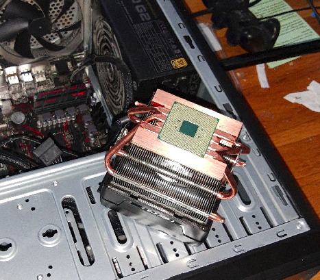

Date: 2020-10-21
Tags: cpu, ryzen, bios flash, upgrade, tech gore
Category: blog
Title: I don't like hardware upgrades
Authors: jeff

Recently I decided to upgrade my workstation's Ryzen 1800X to a newer Ryzen 3700X. 
After I replaced the CPU it didn't POST as I forgot to flash my 3+ year old bios before hand.
Thankfully after putting the old cpu back in, flashing it and putting the new cpu back in it POSTs again.

I hate hardware upgrades so god damn much.
